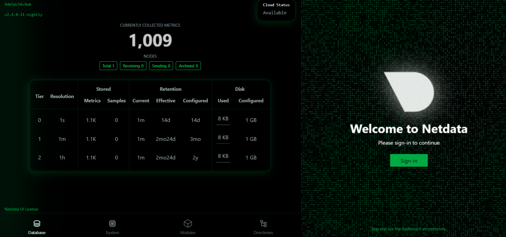

# DevOps Task 7 – Netdata Installation and Monitoring

## 🎯 Objective:
Set up and use **Netdata** to monitor real-time system performance metrics such as CPU, RAM, disk I/O, and network usage.

---

## 🛠️ Steps to Complete the Task:

### 1. Update system packages:
```bash
sudo apt update
```

### 2. Install Netdata:
Use the official Netdata one-liner installation script:
```bash
bash <(curl -Ss https://my-netdata.io/kickstart.sh)
```

> This will automatically install Netdata and start the dashboard.

### 3. Access Netdata dashboard:
Once installed, open this in your browser:
```
http://localhost:19999
```

### 4. Dashboard Verification:
You should now see a detailed, live monitoring dashboard.

---

## 🖼️ Screenshot:



> This screenshot was captured after successful setup and running of the dashboard on the local machine.

---

## 📂 Files in this Repository:

- `README_Task7.txt` – Task instructions or summary.
- `netdata_dashboard_screenshot.png` – Screenshot of the Netdata dashboard.
- `screenshot.png.png` – Additional image/screenshot (optional).

---

## ✅ Task Status:
✔️ Netdata successfully installed and dashboard verified on: **17 April 2025**

---

## 👩‍💻 Author:
**Polanki Sravya**
